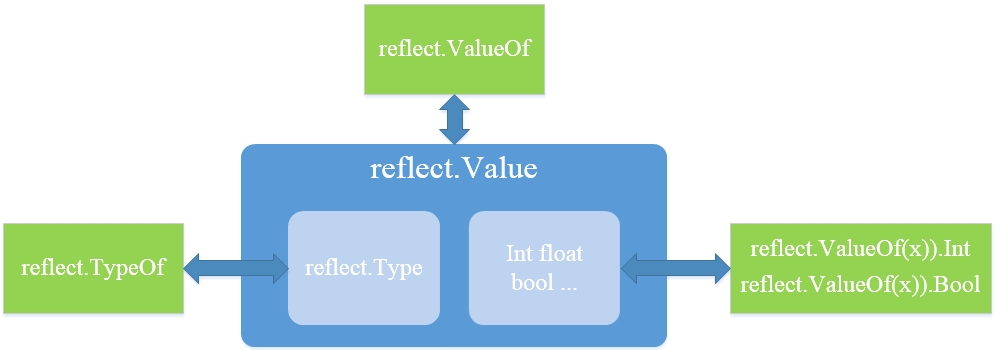
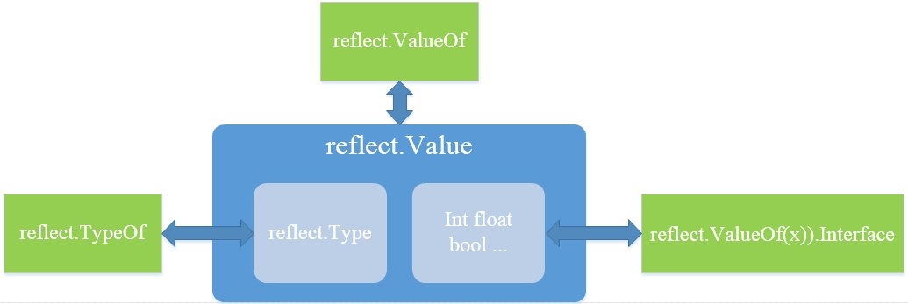

# 语言详解

## 类型

1. 变量
    - 使用 `var` 可以一次定义多个变量
    - `简短模式` 声明变量只能在函数内部使用
    - `简短模式` 并不总是重新定义变量，也可能是不分退化的赋值操作
        - `退化赋值`的前提条件是:至少有一个新变量被定义，且必须是同一作用域
    - 变量定义就要使用，否则编译会报错

2. 命名
    - 以字母或下划线开始，有多个字母数字和下划线组合而成，区分大小写
    - 局部变量优先使用短名
    - 不要使用保留关键字
    - 专有名词通常全部大写，如 `escapeHTML`
    - 首字母大写的为导出成员，可被包外引用，而小写则仅能在包内使用
    - `_` 空标识符，忽略占位符使用

3. 常量

    常量的值必须是编译期可确定的字符，字符串，数组或布尔值。可指定常量的类型，或由编译器通过初始化推断。
    - 可在函数代码块中定义常量，不曾使用的常量不会引发编译错误
    - 常量值也可以是某些编译器能计算出结果的表达式，如`unsafe.Sizeof`、`len`、`cap` 等

    ```golang
    import "unsafe"
    const (
        ptrSize = unsafe.Sizeof(uintptr(0))
        strSize = len("hello, world!")
    )
    ```

    - 在常量组中如果不指定类型和初始化值，则与上一行非空常量右值(表达式文本)相同

    ```golang
    import "fmt"
    func main() {
        const (
            x uint16 = 10
            y               // 与上一行的 x 类型和值相同
            s = "abc"
            z               // 与上面 s 类型和值相同
        )
        fmt.Printf("%T, %v\n", y, y)    // uint16, 120
        fmt.Printf("%T, %v\n", z, z)    // string, abc
    }
    ```

    - 借助`iota` 标识符实现一组自增常量值来事项枚举类型

    ```golang
    const (
        _ = iota // 0
        KB = 1 << (10 * iota) // 1 << (10*1)
        MB                    // 1 << (10*2)
        GB                    // 1 << (10*3)    
    )
    
    // 可在多常量定义中使用多个 iota,他们各自单独计数，只需保证每组中每行常量的列数量相同即可
    const (
        _, _ = iota, iota * 10  // 0, 0 * 10
        a, b                    // 1, 1 * 10
        c, d                    // 2, 2 * 10
    )
    
    // 如终端 iota 自增，则必须显示恢复。且后续自增值按行序递增
    const (
        a = iota    // 0
        b           // 1
        c = 100     // 100
        d           // 100
        e = iota    // 4 (恢复 iota 自增，计数包括 c, d)
        f           // 5
    )
    ```

    - 在实际编码中，建议用自定义类型实现用途明确的枚举类型

4. 基本类型

    类型    | 长度 | 默认值| 说明
    --------|----- | ----- | ----
    bool | 1 | false |
    byte | 1 | 0 | uint8 的别名
    int, uint| 4, 8 | 0 | 默认整数类型，依据目标平台，32或64
    int8, uint8 | 1 | 0 |  -128 ~ 127, 0 ~255
    int16, uint16 | 2 | 0 | -32768 ~ 32767, 0 ~ 65535
    int32, uint32 | 4 | 0 | -21亿 ~ 21亿, 0 ~ 42亿
    int64, uint64 | 8 | 0 |
    float32 | 4 | 0.0 |
    float64 | 8 | 0.0 |
    complex64 | 8 |
    complex128| 16
    rune | 4 | 0 | Unicode Code Point, int32 的别名
    uintptr | 4, 8| 0 | 足以存储指针的 uint
    string | | "" | 字符串，默认是空字符串，而非 NULL
    array | | | 数组
    struct | | | 结构体
    function | | nil | 函数
    interface | | nil | 接口
    map | | nil | 字典，引用类型
    slice | | nil | 切片，引用类型
    channel | | nil | 通道，引用类型

    - 标准库 `strconv` 可以在不同进制(字符串)间转换

    ```golang
    func main() {
     a, _ := strconv.ParseInt("100", 2, 32)
     b, _ := strconv.ParseInt("100", 8, 32)
     c, _ := strconv.ParseInt("100", 16, 32)
     fmt.Printf("%T, %v\n", a, a) // int64, 4
     fmt.Printf("%T, %v\n", b, b) // int64, 64
     fmt.Printf("%T, %v\n", c, c) // int64, 256
    }
    ```

5. 引用类型

    所谓引用类型(reference type) 特指 slice, map, channel 这三种预定义类型。
    - 内置函数`new`按指定类型长度分配零值内存，返回指针，并不关心类型内部结构和初始化方式
    - 而引用类型则必须使用 make 函数创建，编译器会将 make 转化为目标类型专用的粗啊年函数，以确保完成全部内存分配和相关属性初始化
    - 使用 `new` 也可以为引用类型分配内存，但这是不完整创建。以字典为例，它仅分配了字典类型本身(实际就是个指针包装)所需内存，并名优分配键值存储内存，也没有初始化散列通等内部属性，因此无法正常工作

    ```golang
    func main() {
     p := new(map[string]int) //函数 new 返回指针
     m := *p
     m["a"] = 1 // paanic: assignment to entry in nil map
     fmt.Println(m)
    }
    ```

6. 类型转换
    - 除常量、别名类型以及未命名类型外，Go 强制要求使用显示类型转化
    - 同样不支持将非 bool 类型结果当做 true/false 使用
    - 如果转换的目标是指针，单项通道或没有返回值的函数类型，那么必须使用括号，以避免造成语法分解错误

7. 自定义类型
    - 使用关键字 `type` 定义用户自定义类型，包括基于现有基础类型创建，或者结构体函数类型等
    - 和 `var`、`const` 类似，多个`type`定义可合并成组，可在函数或代码块内定义局部类型
    - 与有明确标识符的 `bool int string`等类型相比，数组，切片，字典，通道等类型与具体元素类型或长度等属性有缘，故称作未命名类型`(unnamed type)`。可用 `type` 为其提供具体名称，将其改变为命名类型`(named type)`
    - 具有相同声明的未命名类型被视作同一类型
        - 具有相同基类型的指针
        - 具有相同元素类型和长度的数组 array
        - 具有相同元素类型的切片 slice
        - 具有相同减值类型的字典 map
        - 具有相同数据类型及操作方向的通道 channel
        - 具有相同字段序列(字段名，字段类型，标签以及字段顺序)的结构体 struct
        - 具有相同签名(参数和返回值列表，不包括参数名)的函数 func
        - 具有相同方法集(方法名，方法签名，不包括顺序)的接口 interface

## 表达式

1. 保留字
    25个 | 保 | 留 | 关键 | 字
    ---|---| - | -| -|
    break | default | func | interface | select
    case | defer | go | map | struct
    chan | else | goto | package | switch
    const | fallthrough | if | range | type
    continue | for | import | return | var

2. 运算符
3. 初始化

    对符合类型（数组，切片，字典，结构体）变量初始化时有一些语法限制
    - 初始化表达式必须含类型标签
    - 左边花括号必须在类型尾部，不能另起一行
    - 多个成员出数值以逗号分隔
    - 允许多行，但每行必须以逗号或右花括号
4. 流控制

## 函数

1. 定义

    - 无需前置声明
    - 不支持命名嵌套定义
    - 不支持同名函数重载
    - 不支持默认参数
    - 支持不定长参数
    - 支持多返回值
    - 支持命名返回值
    - 支持匿名函数和闭包

    建议命名规则
    - 通常是动词和介词加上名词，例如 `scanWords`
    - 避免不必要的缩写`printError`要比`printErr`更好一些
    - 避免使用类型关键字，如`buildUserStruct`
    - 避免歧义，不能有多种用途的解释造成误解
    - 避免只能通过大小写区分的名词函数
    - 避免与内置函数同名
    - 避免使用数字，除非是特定专有名词，例如`UTF8`
    - 避免添加作用域提示前缀
    - 统一使用`camel/pascal case`拼写风格
    - 使用相同术语，保持一致性
    - 使用习惯用语，比如`init`表示初始化，`is/has`返回布尔值结果
    - 使用反义词组命名行为相反的函数，如`get/set`,`mix/max`等

2. 参数

    - 不管是指针、引用类型还是其他类型参数，都是值拷贝传递。区别无非是拷贝目标对象还是拷贝指针而已
    - 如果函数参数过多，建议将其重构为一个符合结构类型，也算是变相实现可选参数和命名实参功能
    - 变参本质上就是一个切片。只能接收一到多个同类型参数，且必须放到列表尾部

3. 返回值
4. 匿名函数
    - 闭包是函数和引用环境的组合体。闭包通过指针引用环境变量，那么可能会导致其生命周期延长，甚至被分配到堆内存。另外还有所谓的"延迟求值"特性

    ```golang
    package main
    import "fmt"

    func test() []func() {
        var s []func()

        for i := 0; i < 2; i++ {
            // x := i               // x 每次循环都重新定义
            s = append(s, func() {
                fmt.Println(&x, x)
            })
        }
        return s
    }

    func main() {
        for _, f := range test() {
            f()
        }
    }
    // 输出的结果两次相同 且i 的值为2
    // 这是应为for 循环复用了局部变量i,每次添加的匿名函数引用的自然是同意变量。
    // 解决办法就是每次用不同的环境变量或传参复制，让各自闭包环境各不相同
    ```

    - 多个匿名函数引用同意环境变量，任何的修改行为都会影响其他函数取值，在并发模式下可能要做同步处理

5. 延迟调用

    - 长用语释放资源，解除锁定，已经错误处理等操作
    - 多个延迟注册按从后向前执行
    - 延迟调用在函数结束时才被执行
    - 相比直接用`CALL`汇编指令调用函数，延迟调用则需花费更大代价。这其中包括注册，调用等操作，还有额外的缓存开销

6. 错误处理

    - `error`总是最后一个返回参数
    - 错误变量通常以`err`作为前缀，且字符串内容全部小写，没有结束标点，以便于恰如到其他格式化字符串中输出
    - 自定错误类型通常以`Error`为名称猴子。在用`switch`按类型匹配时，注意`case`顺序。应将自定义类型放在前面，优先匹配更具体的错误类型

    大量函数和方法返回`error`，使得调用代码变得很难看，一堆堆的检查语句充斥代码间。解决思路有
    - 使用专门的检查函数处理错误逻辑（比如记录日志），简化检查代码
    - 在不影响逻辑的情况下，使用defer延迟处理错误状态（err 退化赋值）
    - 在不中断逻辑的情况下，将错误作为内部状态保持，等最终"提交"时再处理

    `panic, recover`
    - 与`error`相比，panic/recover 在使用方法上更接近`try/catch`结构化异常
    - `panic`会立即中断当前函数流程，执行延迟调用。而在延迟调用函数中，`recover`可以捕获并返回`panic`提交的错误对象
    - 连续调用`panic`，仅最后一个会被`recover`捕获
    - `recover`必须在延迟调用函数中执行才能正常工作
    - `建议：`除非不可恢复性，导致系统无法正常工作的错误，否则不建议使用`panic`

## 数据

1. 字符串

    - 字符串是不可变字节(byte)序列，其本身是一个符合结构
    - 默认以`UTF-8`编码存储`Unicode`字符
    - 内置函数 `len` 返回字节数组长度，`cap`不接受字符串类型参数
    - 使用 "`" 定义不做转义处理的原始字符串，支持跨行
    - 允许以索引号访问字节数组(非字符)，但不能获取元素地址
    - 以切片语法（其实和结束索引号）返回子串时，其内部依旧指向原字节数组
    - 使用 for 便利字符串时，分`byte`和`rune`两种方式
    - 要修改字符串，必须将其转化为可变类型(`[]rune` 或 `[]byte`),待完成后在转换回来。不管如何转换，都需重新分配内存，并复制数据
    - 某些时候，转换操作会拖累算法性能，可尝试用`非安全`方法进行改善
    - 使用`append`函数，可将`string`直接追加到`[]byte 内`

    ```golang
    var bs []byte
    bs = append(bs, "abc"...)
    fmt.println(bs)
    ```

    - 动态构建字符串也容易造成性能问题，用加法操作字符串时，每次都需重新分配内存。改进思路是预分配足够的内存。常用方法是用`strings.Join()`函数，他会统计所有参数的长度，并一次性完成内存分配操作
    - 使用`bytes.Buffer`也能完成类似`strings.Join()`的共，且性能相当
    - `Unicode` 类型`rune`专门用来存储`Unicode` 码点，`int32`的别名。使用单引号的字面量，其默认类型就是 rune
    - 除`[]rune` 外，还可直接在`rune`、`byte`、`string`间进行转换

    ```golang
    r := '我'
 s := string(r) // rune to string
 b := byte(r)   // rune to byte

 s2 := string(b) // byte to string
 r2 := rune(b)   // byte to rune

 fmt.Printf("%T, %v\n", s, s)   // string， 我
 fmt.Printf("%T, %v\n", b, b)   // uint8, 17
 fmt.Printf("%T, %v\n", s2, s2) // string,
 fmt.Printf("%T, %v\n", r2, r2) // int32, 17
    ```

2. 数组

    定义数组类型时，数组长度必须是非负整型常量表达式，长度是类型组成部分。也就是说，元素类型相同，但长度不同的数组不属于同一类型。
    - 在定义多维数组时，仅第一维度允许使用`...`
    - 内置函数`len`和`cap`都返回第一维度长度
    - 指针数组是指元素为指针类型的数组，数组指针是获取数组变量的地址
    - `Go`数组是值类型，赋值和传参操作都会复制整个数组数据，如果需要可以改用指针或切片，避免数据复制

3. 切片

    切片本身并非动态数组或数组指针。它内部通过指针引用底层数组，设定相关属性将数据写操作限定在指定区域内。
    - `append()` 向切片尾部`(slice[len])`添加数据，分会新的切片对象

    ```
    数据被追加到原底层数组。如超出cap 的限制，则为新的切片对象重新分配数据数组
    注意：
    1. 是超出切片 cap 限制，而非底层数组长度相纸，因为 cap 可以小于数组长度
    2. 新分配数组长度是原 cap 的2倍，而非原数组的2倍
    3. 并非总是2倍，对于较大的切片，会尝试扩容1/4,以节约内存
    4. 向 nil 切片追加数据时，会为其分配底层数组内存
    ```

    ```golang
    var s []int
    s = append(s, 1, 2, 3)
    fmt.Println(s)
    ```

    - `copy()`在两个切片对象间复制数据，允许指向同一底层数据，最终所复制长度以较短的切片长度`(len)`为准
    - 还可以直接从字符串中复制数据到`[]byte`

4. 字典

    字典是引用类型，使用`make`函数或初始化表达式语句来创建。访问不存在的兼职，默认返回零值，不会引发错误,但推荐使用`ok-idiom`模式。对字典进行迭代，每次返回的健值次序都不相同。
    - `len` 返回当前键值对数量，`cap`不接受字典类型

5. 结构

    结构体`(struct)`将多个不同类型命名字段`(field)`序列打包成一个符合类型。字段名必须唯一，可用`"_"`补位，支持使用自身指针类型成员。
    - 字段标签 字段标签并不是注释，而是用来对字段进行描述的元数据。尽管它们不属于数据成员，但却是类型的组成部分。在运行期，可用反射获取标签信息。它常被用作格式校验，数据库关系映射等。

    ```golang
    type user strcut {
        name string `昵称`
        sex  byte   `性别`
    }
    
    func main() {
        u := user{"Tom", 1}
        v := reflect.ValueOf(u)
        t := v.Type()
        
        for i, n := 0, t.NumField(); i < n; i++ {
            fmt.Printf("%s:%v\n", t.Field(i).Tag, v.Field(i))
        }
    }
    // 昵称:Tom
    // 性别:1
    ```

    - 内存布局 不管结构体包含多少字段，其内存总是一次性分配的，个字段在相邻的地址空间按定义顺序排列。借助 `unsafe`包中的相关函数，可以输出所有字段的偏移量和长度。

## 方法

1. 定义

    方法是与对象实例绑定的特殊函数。方法和函数定义语法区别是在于方法有前置实例接收参数(`receiver`) 编译器以此确定方法所属类型。可以为当前包，以及出结果和指针以为的任何类型定义方法。 方法同样不支持重载。`receiver`参数名没有限制，按照惯例会选用剪短有意义的名称(不推荐使用 `this`、`self`)

    如何选择方法的 `receiver`类型
    - 要修改示例状态，用`*T`
    - 无需修改状态的小对象或固定值，建议用`T`
    - 大对象建议用`*T`,以较少复制成本
    - 应用类型，字符串，函数等指针包装对象，直接用`T`
    - 若包含`Mutex`等同步字段，用`*T`,避免因复制造成锁操作无效
    - 其它无法确定的情况，都用`*T`

2. 匿名字段

    - 可以像访问你名字段成员那样调用其方法，由编译器负责查找

    ```golang
    type data struct {
        sync.Mutex
        buf []byte
    }
    func main() {
        d := data{}
        d.Lock()    // 编译会处理为 sync.(*Mutex).Lock() 调用
        defer d.Unlock()
    }
    ```

    - 方法也会有同名遮蔽问题，利用这种特性，可实现类似覆盖操作

3. 方法集

    类型有一个与之相关的防腐集，这决定了它是否实现了某个接口
    - 类型 `T` 方法集包含所有 `receiver T` 方法
    - 类型 `*T` 方法集包含所有 `receiver T + *T` 方法
    - 匿名嵌入 `S`, `T` 方法集包含所有 `receiver S` 方法
    - 匿名嵌入 `*S`, `T` 方法集包含所有 `receiver S + *S`方法
    - 匿名嵌入 `S`或`*S`, `*T` 方法集包含所有 `receiver S + *S`方法

    可利用反射`(reflect)`测试这些规则。方法集仅影响接口实现和方法表达式转换，与通过实例或指针调用方法无关。实例并不使用方法集，而是直接调用。

4. 表达式

    方法和函数一样，除直接调用外，还可复制给变量，或作为参数传递。依照具体引用方式的不同，可分为`expression`和`value`两种状态

## 接口

1. 定义

    接口是一种调用契约，是多个方法声明的集合。`Go`接口实现机制很简洁，只要目标类型方法集内包含接口声明的全部方法，就被视为实现了该接口，无须做显示声明。

    接口通常以`er`作为名称后缀，方法名是声明组成部分，但是参数名可不同或省略

    - 接口内不能有字段
    - 不能定义自己的方法
    - 只能声明方法，不能是实现
    - 可嵌入其他接口类型

2. 执行机制

    接口使用一个名为`itab`的结构存储运行期间所需的相关类型信息。

    ```golang
    type iface struct {
        tab *itab               //类型信息
        data unsafe.Pointer     // 实际对象指针
    }
    
    type itab struct {
        inter   *interface      //接口类型
        _type   *——type         //实际对象类型
        func    [1]uintptr      //实际对象方法地址
    }
    ```

    - 接口还有一个重要特征：将对象赋值给接口变量时，会复制该对象

3. 类型转换

    类型推断可将接口变量还原为原始类型，或用来判断是否实现了某个具体的接口类型。

4. 技巧

    - 让编译器检查，确保类型实现了指定接口
    - 定义函数类型，让相同签名的函数自动实现某个接口

## 并发

1. 并发的含义

    并发：逻辑上具备同时处理多个任务的能力

    并行：物理上在同一时刻执行多个并发任务

    并行是并发设计的理想执行模式。多线程或多进程是并行的基本条件，但单线程也可以协程做到并发。尽管协程在单个线程上通过主动切换来实现多个任务并发，但他也有自己的优势。除了将因阻塞而浪费的时间找回来外，还免去了协程切换开销，有着不错的执行效率。协程上运行的多个任务本质是依旧串行的，加上可控自主调度，所以并不需要做同步处理。

    - 只需要在函数调用前添加 `go` 关键字即可创建并发任务
        - 注意是函数调用，所以必须提供相应的参数
    - 关键字`go` 并非执行并非操作，而是创建一个并发任务单元，运行时也不保证并发任务的执行次序
    - 与 `defer`一样, `goroutine`也会因`延迟执行`,而立即计算并复制执行参数

    ```golang
    package main
    
    import "time"
    
    var c int

    func counter() int {
        c++
        return c
    }

    func main() {
        a := 100
        go func(x, y int) {
            time.Sleep(time.Second) // 让goroutine在main逻辑之后执行
            println("go:", x, y)
        }(a, counter())
        a += 100
        println("main:", a, counter())
        time.Sleep(time.Second * 3) // 等待goroutine结束 如果没有该值不会输出 go: 100 1
    }
    // main: 200 2
    // go: 100 1
    ```

    - `wait` 进程退出时不会等待并发任务结束，可用通道(`channel`)阻塞，然后发出退出信号

    ```golang
    func main() {
        exit := make(chan struct{}) // 创建通道，因为仅有通知，数据并没有实际意义
    
        go func() {
            time.Sleep(time.Second)
            println("goroutine done.")
            close(exit)             // 关闭通道，发出信号
        }()
    
        println("main ...")
        <-exit  // 如通道关闭，立即解除阻塞
        println("main exit.")
    }
    ```

    - 如果等待多个任务结束，推荐使用`sync.WaitGroup`.通过设计计数器，让每个`goroutine`在推出前递减，直至归零时解除阻塞

    ```golang
    package main

    import (
     "sync"
     "time"
    )
    
    func main() {
     var wg sync.WaitGroup
    
     for i := 0; i < 10; i++ {
      wg.Add(1)
    
      go func(id int) {
       defer wg.Done()
    
       time.Sleep(time.Second)
       println("goroutine", id, "done.")
      }(i)
     }
     println("main ...")
     wg.Wait()
     println("main exit.")
    }
    
    /**
    main ...
    goroutine 8 done.
    goroutine 2 done.
    goroutine 3 done.
    goroutine 7 done.
    goroutine 9 done.
    goroutine 6 done.
    goroutine 1 done.
    goroutine 0 done.
    goroutine 5 done.
    goroutine 4 done.
    main exit.
    */
    // 尽管 WaitGroup.Add 实现了院子操作，但建议在 goroutine 外累加计数器，以免 Add尚未执行，Wait 已经退出
    
    // Add 累加计数
    // Wait 接触阻塞
    // Done 递减计数
    ```

    - `GOMAXPROCS` 运行时可能会创建很多线程，但任何时候仅有限的几个线程参与并发任何执行。该数量默认与处理器核数相等，可用 `runtime.GOMAXPROCS`函数修改
    - 与线程不同，goroutine 任务无法设置优先级，无法获取编号，没有局部存储，甚至连返回值都会被抛弃。
    - `Gosched` 暂停，释放线程去执行其他任务。当前任务被放回队列，等待下次调度时恢复执行。该函数很少用到，因为运行时会主动向长时间运行(10ms)的任务发出抢占调度。
    - `Goexit` 立即终止当前任务，运行时确保所有已注册延迟调用被执行。
        - 该函数不影响其他并发任务，不会引发 `panic`
        - 如果在`main.main`里调用`Goexit`,它会等待其他任务结束，然后让进城直接崩溃
        - 无论身处哪一层，Goexit 都能立即终止整个调用堆栈，这与 return 仅退出当前函数不同。标准库函数 os.Exit 可以终止进程，但不会执行延迟调用

2. 通道

    除传递消息(数据)外，通道还常被用做事件通知。

    除使用简单的发送和接收操作符外，还可用`ok-idom`或`range`模式处理数据

    及时用`close`函数关闭通道引发结束通知，否则可能会导致死锁

    一次性事件用`close`效率更好，没有多余的开销。连续或多样性事件，可传递不同数据标志实现。还可使用`sync.Cond`实现单播或广播事件。

    对于`closed`或`nil`通道，发送和接收操作都有相应规则：
    - 向已关闭通道发送数据，引发`panic`
    - 从已关闭接收数据，返回已缓冲数据或零值
    - 无论收发，`nil`通道都会阻塞

    - 通道默认是双向的，并不区分发送和接收端。但某些时候，我们可限制收发操作的方向来获得更严谨的操作逻辑

    - 如果要同时处理多个通道，可选用`select`语句。它会随机选择一个可用通道做收发操作

3. 同步

## 包结构

1. 工作空间

    工作空间由`src`,`bin`,`pkg`三个目录组成。通常需要将空间路径添加到 GOPATH 环境变量列表中

2. 导入包

3. 组织结构

4. 依赖管理

## 反射

反射的三法则：
[`参考1`](http://speakingbaicai.blog.51cto.com/5667326/1707637)
[`参考2`](http://blog.golang.org/laws-of-reflection)

- 从类型和方法理解反射内涵

    在基本的曾明上，反射只是一个检查存储在接口变量中的类型和值的算法。使用反射机制，首先要导入`reflect`包，`reflect`包中有两个重要类型需要了解，`reflect.Type`和`reflect.Value`，这两个类型使得可以访问变量的内容。于此相关的还有两个简单的函数，`reflect.TypeOf`和`reflect.ValueOf`,可以从接口值中分别获取`reflect.Type`和`reflect.Value`.

    下图只管的表明值，类型，实际的值的关系
    
- 法则一：从接口值到反射对象的反射

    >`func ValueOf(i interface{}) Value`

    >`func TypeOf(i interface{}) Type`
- 法则二：从反射对象到接口值的反射
    
- 法则三：为了修改反射对象，其值必须可设置

1. 类型
2. 值
3. 方法
4. 构建
5. 性能

## 测试

1. 单元测试

>`testing` 工具链和标准库自带单元测试框架，折让测试工作变得相对容易

- 测试代码必须放在当前包以 `_test.go`结尾的文件中
- 测试函数以`Test`为名称前缀
- 测试命令`go test` 忽略以`_`或`.`开头的测试文件
- 正常编译操作`go build/install` 会忽略测试文件

>标准库`testing`提供了专门类型`T`来控制测试结果和行为

方法  | 说明 | 相关
---|---| ---
Fail | 失败：继续执行当前测试函数
FailNow | 失败：立即终止执行当前测试函数 | Failed
SkipNow | 跳过：停止执行当前测试函数 | Ship, Skipf, Skipped
Log     | 输出错误信息，仅失败或 -v 时输出 | Logf
Parallel| 与有同样设置的测试函数并行执行 | 可有效利用多核并行优势，缩短测试时间
Error   | Fail + Log | Errorf
Fatal   | FailNow + Log | Fatalf

> 常用的测试参数

- `-args` 命令行参数
- `-v` 输出详细信息
- `-parallel` 并发执行，默认值为`GOMAXPROCS` -parallel 2
- `-run` 指定测试函数，正则表达式 - run "Add"
- `-timeout` 全部测试累计时间超时将引发`panic`，默认值是 `10ms` -timeout 1m30s
- `-count` 重复测试次数，默认值为1

>`test main`

某些时候需为测试用例提供初始化和清理操作，但`testing`并没有`setup/teardown`机制。解决方法是自定义一个名为 `TestMain()`的函数，`go test` 会改为执行该函数，而不再是具体的测试用例。

2. 性能测试

    - 性能测试函数以 `Benchmark`为名称前缀，同样保存在`*_test.go`文件里

    ```golang
    package main

    import "testing"
    
    func add(x, y int) int {
        return x + y
    }
    
    func BenchmarkAdd(b *testing.B) {
        for i := 0; i < b.N; i++ {
            _ = add(1, 2)
        }
    }
    
    // 测试使用： go test -bench .
    // 测试工具默认不会执行性能测试，须使用 bench 参数。它通过逐步调整 B.N 值，反复执行测试函数，知道能获得准确的测量结果
    ```

    - `timer` 如果在测试函数中要执行一些额外操作，那么应该临时阻止计时器工作
    - `memory` 性能测试关心的不仅仅是执行时间，还包括在堆上的内存分配，因为内存分配和垃圾回收的相关操作也应计入消耗成本。

3. 代码覆盖率
4. 性能监控

## 工具链

1. 安装
2. 工具

    - `go build` 此命令默认每次都会重新编译除标准库以外的所有依赖包
    - `go install` 和`build`参数相同，但会将编译结果安装到`bin`，`pkg`目录。
    - `go get` 将第三方包下载到`GOPATH`列表的第一个工作空间。默认不会检查更新，需使用 `-u` 参数
    - `go env` 显示全部或指定环境参数
    - `go clean` 清理工作目录，删除编译和安卓遗留的目标文件

3. 编译

# 源码分析

## 引导

事实上，编译好的可执行文件真正的执行入口冰粉是我们缩写的`main.main`函数，因为编译器总会插入一段引导代码，完成诸如命令行参数，运行时初始化等工作。
