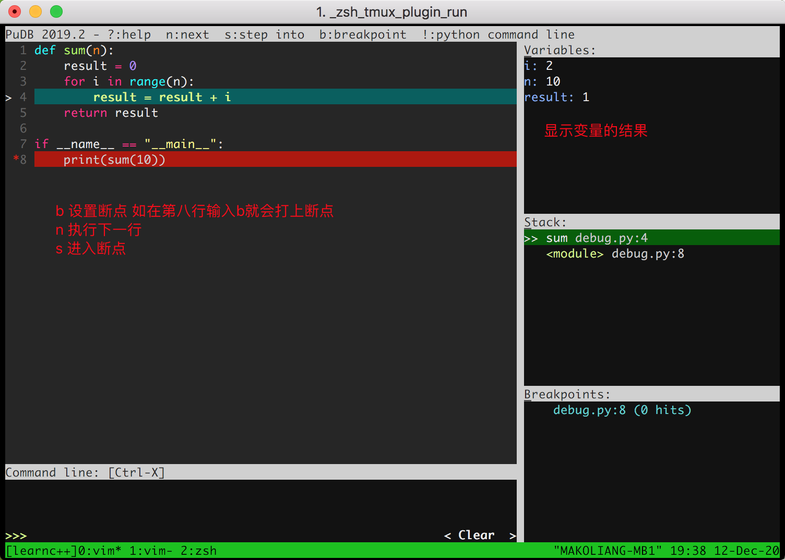

# pudb调试程序


参考 https://github.com/inducer/pudb



## 安装

```
pip install pudb
```

## 使用

如下面的Python程序 `debug.py`

```python
def sum(n):
    result = 0
    for i in range(n):
        result = result + i
    return result

if __name__ == "__main__":
    print(sum(10))
```

- 进入调试模式, 界面如下图

```
python3 -m pdb.run debug.py
```




## 常用的调试命令

- Ctrl+p: 打开属性设置
- n: next，也就是执行一步
- s: step into，进入函数内部
- f: finsh current function，结束当前函数？
- c: continue，继续执行
- b: break point，在光标所在行添加或消除断点
- t: to cursor，运行到光标位置
- !: 打开python命令行
- ?: 打开帮助窗口
- o: output screen，打开输出窗口/控制台
- m: module，打开模块
- q: quit，退出PUDB
- /: 搜索
- ,/. 搜索下一个/上一个
