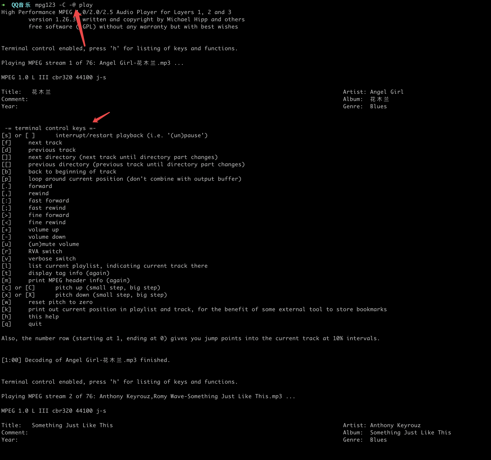

# 命令行下播放音乐

追求极致简单操作，在命令行下控制音乐的播放，可以为本地文件也可以是网络文件。下面示例已播放本地下载的音乐为例。

播放的 `play` 文件内容如下, 本地文件的路径，也可以为网络地址 `http://xxxxx.mp3`

```
➜  ~ head play
/Users/mako/Music/QQ音乐/Angel Girl-花木兰.mp3
/Users/mako/Music/QQ音乐/Anthony Keyrouz,Romy Wave-Something Just Like This.mp3
/Users/mako/Music/QQ音乐/Arman Cekin,Charlie Puth,Kehlani,Drake-Hotline Bling (Charlie Puth & Kehlani Cover) (Wildfellaz & Arman Cekin Remix).mp3
/Users/mako/Music/QQ音乐/Austin Mahone,Rich Homie Quan-Send It.mp3
/Users/mako/Music/QQ音乐/Bout,Magnificence,Forrest Park-I Belong To U.mp3
/Users/mako/Music/QQ音乐/Carly Rae Jepsen-Party For One.mp3
/Users/mako/Music/QQ音乐/Cavaro,Louis Vivet,Gavrielle-Best Thing (Cavaro Remix).mp3
/Users/mako/Music/QQ音乐/Cazzette,Leo Stannard-Oceans.mp3
/Users/mako/Music/QQ音乐/Charlie Puth-Look At Me Now.mp3
/Users/mako/Music/QQ音乐/Conor Maynard-Faded.mp3
```

## mpg123 命令

`Mac`上安装`mpg123` 直接采用 `brew` 其它平台请自行搜索

```
brew install mpg123
```

在命令行模式下全部播放 `mpg123 -C -@ play`

- `-C` 命令行下控制播放
- `-Z` 随机播放
- ` ` 空格键暂定
- `f` 下一首
- `d` 上一首
- `l` 查看播放列表
- `q` 静默模式不输出内容
- `h` 查看帮助信息




## vlc 命令行模式


具体参考 [https://wiki.videolan.org/Console/](https://wiki.videolan.org/Console/)


- `vlc -I rc`

进入命令行模式后使用 help 查看支持的命令按照命令操作即可

```
➜  ~ vlc -I rc
VLC media player 3.0.11.1 Vetinari (revision 3.0.11.1-0-g52483f3ca2)
[00007fada760f6b0] main playlist: playlist is empty
[00007fada8214d90] [cli] lua interface: Listening on host "*console".
VLC media player 3.0.11.1 Vetinari
Command Line Interface initialized. Type `help' for help.
> help
+----[ CLI commands ]
| add XYZ  . . . . . . . . . . . . . . . . . . . . add XYZ to playlist
| enqueue XYZ  . . . . . . . . . . . . . . . . . queue XYZ to playlist
| playlist . . . . . . . . . . . . .  show items currently in playlist
| search [string]  . .  search for items in playlist (or reset search)
| delete [X] . . . . . . . . . . . . . . . . delete item X in playlist
| move [X][Y]  . . . . . . . . . . . . move item X in playlist after Y
| sort key . . . . . . . . . . . . . . . . . . . . . sort the playlist
| sd [sd]  . . . . . . . . . . . . . show services discovery or toggle
| play . . . . . . . . . . . . . . . . . . . . . . . . . . play stream
| stop . . . . . . . . . . . . . . . . . . . . . . . . . . stop stream
| next . . . . . . . . . . . . . . . . . . . . . .  next playlist item
| prev . . . . . . . . . . . . . . . . . . . .  previous playlist item
| goto, gotoitem . . . . . . . . . . . . . . . . .  goto item at index
| repeat [on|off]  . . . . . . . . . . . . . .  toggle playlist repeat
| loop [on|off]  . . . . . . . . . . . . . . . .  toggle playlist loop
| random [on|off]  . . . . . . . . . . . . . .  toggle playlist random
| clear  . . . . . . . . . . . . . . . . . . . . .  clear the playlist
| status . . . . . . . . . . . . . . . . . . . current playlist status
| title [X]  . . . . . . . . . . . . . . set/get title in current item
| title_n  . . . . . . . . . . . . . . . .  next title in current item
| title_p  . . . . . . . . . . . . . .  previous title in current item
| chapter [X]  . . . . . . . . . . . . set/get chapter in current item
| chapter_n  . . . . . . . . . . . . . .  next chapter in current item
| chapter_p  . . . . . . . . . . . .  previous chapter in current item
|
| seek X . . . . . . . . . . . seek in seconds, for instance `seek 12'
| pause  . . . . . . . . . . . . . . . . . . . . . . . .  toggle pause
| fastforward  . . . . . . . . . . . . . . . . . . set to maximum rate
| rewind . . . . . . . . . . . . . . . . . . . . . set to minimum rate
| faster . . . . . . . . . . . . . . . . . .  faster playing of stream
| slower . . . . . . . . . . . . . . . . . .  slower playing of stream
| normal . . . . . . . . . . . . . . . . . .  normal playing of stream
| rate [playback rate] . . . . . . . . . .  set playback rate to value
| frame  . . . . . . . . . . . . . . . . . . . . . play frame by frame
| fullscreen, f, F [on|off]  . . . . . . . . . . . . toggle fullscreen
| info [X] . .  information about the current stream (or specified id)
| stats  . . . . . . . . . . . . . . . .  show statistical information
| get_time . . . . . . . . .  seconds elapsed since stream's beginning
| is_playing . . . . . . . . . . . .  1 if a stream plays, 0 otherwise
| get_title  . . . . . . . . . . . . . the title of the current stream
| get_length . . . . . . . . . . . .  the length of the current stream
|
| volume [X] . . . . . . . . . . . . . . . . . .  set/get audio volume
| volup [X]  . . . . . . . . . . . . . . .  raise audio volume X steps
| voldown [X]  . . . . . . . . . . . . . .  lower audio volume X steps
| achan [X]  . . . . . . . . . . . .  set/get stereo audio output mode
| atrack [X] . . . . . . . . . . . . . . . . . . . set/get audio track
| vtrack [X] . . . . . . . . . . . . . . . . . . . set/get video track
| vratio [X] . . . . . . . . . . . . . . .  set/get video aspect ratio
| vcrop, crop [X]  . . . . . . . . . . . . . . . .  set/get video crop
| vzoom, zoom [X]  . . . . . . . . . . . . . . . .  set/get video zoom
| vdeinterlace [X] . . . . . . . . . . . . . set/get video deinterlace
| vdeinterlace_mode [X]  . . . . . . .  set/get video deinterlace mode
| snapshot . . . . . . . . . . . . . . . . . . . . take video snapshot
| strack [X] . . . . . . . . . . . . . . . . .  set/get subtitle track
|
| vlm  . . . . . . . . . . . . . . . . . . . . . . . . .  load the VLM
| description  . . . . . . . . . . . . . . . . .  describe this module
| help, ? [pattern]  . . . . . . . . . . . . . . . . .  a help message
| longhelp [pattern] . . . . . . . . . . . . . . a longer help message
| lock . . . . . . . . . . . . . . . . . . . .  lock the telnet prompt
| logout . . . . . . . . . . . . . .  exit (if in a socket connection)
| quit . . . . . . . .  quit VLC (or logout if in a socket connection)
| shutdown . . . . . . . . . . . . . . . . . . . . . . .  shutdown VLC
+----[ end of help ]
> add /Users/mako/Music/QQ音乐/五色石南叶-山水闲人.mp3
> playlist
+----[ Playlist - playlist ]
| 1 - Playlist
|  *3 - 山水闲人 (00:03:45) [played 1 time]
| 2 - Media Library
+----[ End of playlist ]
> stop
> play
>

```
- `vlc --intf ncurses`
